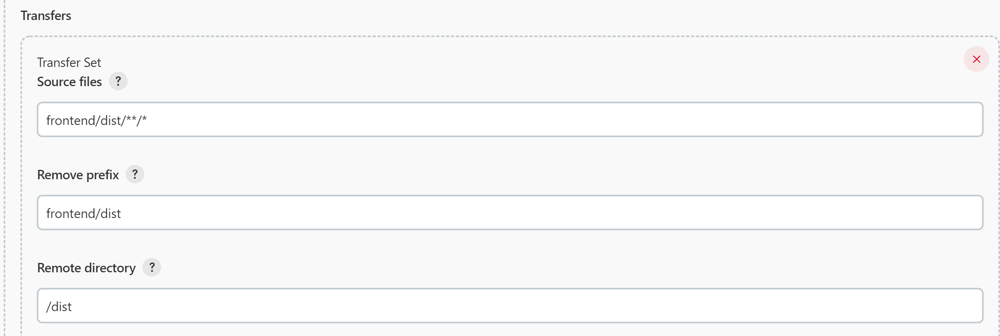

# 배포 가이드

## 버전 정보

- 호스트 머신 설정
    - Docker : `20.10.17`
    - Docker-compose : `1.26.0`
- Front-end 설정
    - Nginx : `1.23.1-alpine`
        - 정적 파일 서비스 및 리버스 프록시
    - Node : `12.16.0`
- Back-end 설정
    - JVM, JRE
        - openjdk version "1.8.0_312"
        - OpenJDK Runtime Environment (Zulu 8.58.0.13-CA-win64) (build 1.8.0_312-b07)
        - OpenJDK 64-Bit Server VM (Zulu 8.58.0.13-CA-win64) (build 25.312-b07, mixed mode)
    - WAS, Web server
        - Spring boot 2.4.5의 내장 WAS spring-boot-starter-web-2.4.5
        - Spring boot 2.4.5의 내장 Web server spring-boot-starter-tomcat-2.4.5
    - IDE
        - intellij 2022.1.2
        - IDE 내에서 로컬 실행시 환경변수로 Amazon S3 서비스의 ACCESS-KEY, SECRET-KEY 설정 필요(없으면 아무 값이나 입력 시 사진 첨부 기능 제외 다른 기능은 정상적으로 동작)

## Docker, Docker-compose

### Docker

1. 유틸 설치
    
    ```bash
    sudo apt update
    sudo apt install apt-transport-https ca-certificates curl software-properties-common
    ```
    
2. 키 생성
    
    ```bash
    curl -fsSL https://download.docker.com/linux/ubuntu/gpg | sudo apt-key add -
    ```
    
3. Repository 추가 후 Update
    
    ```bash
    sudo add-apt-repository "deb [arch=amd64] https://download.docker.com/linux/ubuntu $(lsb_release -cs) stable"
    sudo apt update
    ```
    
4. Docker 설치
    
    ```bash
    sudo apt install docker-ce
    ```
    
5. Docker 설치 확인
    
    ```bash
    sudo systemctl status docker
    ```
    
6. Docker 권한 설정
    
    ```bash
    sudo usermod -aG docker ${USER}
    ```
    

### Docker-compose

1. Docker-compose 설치
    
    ```bash
    sudo curl -L "https://github.com/docker/compose/releases/download/1.26.0/docker-compose-$(uname -s)-$(uname -m)" -o /usr/local/bin/docker-compose
    ```
    
2. 심볼릭 링크 생성, 실행 권한 부여
    
    ```bash
    sudo ln -s /usr/local/bin/docker-compose /usr/bin/docker-compose
    chmod +x /usr/bin/docker-compose
    ```
    
3. 설치 확인
    
    ```bash
    docker-compose -v
    ```
    

## DB Init

1. MeetDoc 서비스 배포를 위한 `meetdoc` 디렉토리 생성
    
    ```bash
    cd /home/ubuntu
    mkdir meetdoc
    cd meetdoc
    ```
    
2. Nginx 배포를 위한 디렉토리 생성
    
    ```bash
    mkdir db
    ```
    
    - `db` : 스키마와 유저를 생성하기 위한 sql이 들어가는 디렉토리
3. `init.sql` 작성
    
    ```bash
    vim ./db/init.sql
    ```
    
    - 만약 vim이 설치되어 있지 않을 경우 vim 설치 후 진행
        
        ```bash
        sudo apt-get update
        sudo apt-get install vim
        ```
        
    - `init.sql` 내용
        
        ```bash
        create database IF NOT EXISTS `meetdoc` collate utf8mb4_general_ci;
        create user 'ssafy'@'%' identified by 'ssafy';
        grant all privileges on *.* to ssafy@'%';
        flush privileges;
        ```
        
4. MySQL과 기본 실행 쿼리를 위한 `docker-compose.yml` 내용
    
    ```bash
    # docker-compose version
    version: "3.8"
    
    #container list
    services:
      db:
        image: mysql:5.7
        container_name: mysql
        restart: always
        volumes:
          # Mount cotainer drive to real drive
          - ./db:/docker-entrypoint-initdb.d
        networks:
          # network inside of a container
          - app-network
        ports:
          - "32000:3306"
        environment:
          MYSQL_ROOT_PASSWORD: meetdoc
          TZ: "Asia/Seoul"
        privileged: true
    ```
    
    - 해당 내용은 아래에서 `docker-compose up` 할 예정입니다.

## Back-end

### Docker Hub 이용하기 (수동 배포 시 사용)

1. Local의 `meetdoc/backend` 경로에서 Docker Image화
    
    ```bash
    docker build --tag <RepositoryName>/<AppName> <DockerfilePath>
    # docker build --tag ramtk6726/meetdoc .
    docker images
    ```
    
    - Docker Image로 만드는 Dockerfile 내용
        
        ```bash
        FROM openjdk:8-jdk-alpine
        ARG JAR_FILE=build/libs/*.jar
        COPY ${JAR_FILE} app.jar
        ENTRYPOINT ["java", "-jar", "/app.jar"]
        ```
        
2. Docker Hub에 Push
    
    ```bash
    docker push <ImageName>
    # docker push ramtk6726/meetdoc
    ```
    
    - Docker Repository는 Docker Hub 가입 후 생성 가능
    - Docker Login 되어 있지 않은 경우
        
        ```bash
        docker login -u <ID>
        password: 
        ```
        
    - 현재 사용 중인 repository는 private이므로 접근이 불가능합니다.
3. Back-end 컨테이너 생성을 위한 `docker-compose.yml`
    
    ```bash
    cd /home/ubuntu/meetdoc
    vim docker-compose.yml
    ```
    
    - 위치 `ubuntu/meetdoc`
    - 내용
        
        ```bash
        # docker-compose version
        version: "3.8"
        
        #container list
        services:
          meetdoc:
            image: ramtk6726/meetdoc
            container_name: meetdoc
            restart: always
            ports:
              - "8081:8081"
            environment:
              TZ: "Asia/Seoul"
              # Spring application.properties DB
              SPRING_DATASOURCE_URL: "jdbc:mysql://db:3306/meetdoc?userUnicode=true&characterEncoding=utf8&serverTimezone=Asia/Seoul&zeroDateTimeBehavior=convertToNull&rewriteBatchedStatements=true"
              server.address: 0.0.0.0
        			ACCESS-KEY: <ACCESS-KEY>
              SECRET-KEY: <SECRET-KEY>
            networks:
              - app-network
            depends_on:
              - db
        ```
        
        - 해당 내용은 아래에서 `docker-compose up` 할 예정입니다.
        - 위 `docker-compose` 파일은 유효하지 않습니다
            - DB 컨테이너가 빠져있는 버전입니다.
        - `docker-compose up` 시 컨테이너가 생성됩니다.
            - 이 때, 이미지 pull을 위해서 Docker Hub 로그인이 필요할 수 있습니다.

### Git Clone 받아 빌드하기 (GUI 미사용, 테스트 X)

- 해당 버전은 build 하기 위해 서버에 적절한 버전의 몇가지를 설치해야 합니다.
    - 참고용으로 작성하는 것이므로 생략합니다.
1. 서버에서 Git clone
    
    ```bash
    cd /home/ubuntu/meetdoc
    git clone <URL>
    ```
    
2. Build
    
    ```bash
    ./<clone받은dir명>/backend/gradlew clean build
    ```
    
3. Build한 파일을 넣을 폴더 생성
    
    ```bash
    mkdir build
    ```
    
4. Build한 파일 복사
    
    ```bash
    cp ./<clone받은dir명>/backend/build/libs/<파일명>.jar ./build/<파일명>.jar
    ```
    
5. Build한 jar를 실행하기 위한 `docker-compose.yml`
    
    ```bash
    vim docker-compose.yml
    ```
    
    - 위치 `ubuntu/meetdoc`
    - 내용
        
        ```bash
        # docker-compose version
        version: "3.8"
        
        #container list
        services:
          meetdoc:
            build:
              context: ./
            container_name: meetdoc
            restart: always
            ports:
              - "8081:8081"
            environment:
              TZ: "Asia/Seoul"
              # Spring application.properties DB
              SPRING_DATASOURCE_URL: "jdbc:mysql://db:3306/meetdoc?userUnicode=true&characterEncoding=utf8&serverTimezone=Asia/Seoul&zeroDateTimeBehavior=convertToNull&rewriteBatchedStatements=true"
              server.address: 0.0.0.0
        			ACCESS-KEY: <ACCESS-KEY>
              SECRET-KEY: <SECRET-KEY>
            networks:
              - app-network
            depends_on:
              - db
        ```
        
        - 해당 내용은 아래에서 `docker-compose up` 할 예정입니다.
        - 위 `docker-compose` 파일은 유효하지 않습니다
            - DB 컨테이너가 빠져있는 버전입니다.
        - `docker-compose up` 시 컨테이너가 생성됩니다.

### Local에서 빌드하여 jar 파일 실행하기

1. Local 워크스페이스 `/backend` 경로에서 터미널로 빌드
    
    ```bash
    .\gradlew clean build
    ```
    
2. 서버 접속 후 Build한 파일을 넣을 폴더 생성
    
    ```bash
    cd /home/ubuntu/meetdoc
    mkdir build
    ```
    
3. /backend/build/libs/<파일명>.jar 경로에 생성된 파일 서버에 업로드
    - 경로 : `/home/ubuntu/meetdoc/build`
    - 업로드 방식은 자유롭게 가능
        - 해당 프로젝트에서는 WinSCP를 사용했습니다.
4. Build한 jar를 실행하기 위한 `docker-compose.yml`
    
    ```bash
    vim docker-compose.yml
    ```
    
    - 위치 `ubuntu/meetdoc`
    - 내용
        
        ```bash
        # docker-compose version
        version: "3.8"
        
        #container list
        services:
          meetdoc:
            build:
              context: ./
            container_name: meetdoc
            restart: always
            ports:
              - "8081:8081"
            environment:
              TZ: "Asia/Seoul"
              # Spring application.properties DB
              SPRING_DATASOURCE_URL: "jdbc:mysql://db:3306/meetdoc?userUnicode=true&characterEncoding=utf8&serverTimezone=Asia/Seoul&zeroDateTimeBehavior=convertToNull&rewriteBatchedStatements=true"
              server.address: 0.0.0.0
        			ACCESS-KEY: <ACCESS-KEY>
              SECRET-KEY: <SECRET-KEY>
            networks:
              - app-network
            depends_on:
              - db
        ```
        
        - 해당 내용은 아래에서 `docker-compose up` 할 예정입니다.
        - 위 `docker-compose` 파일은 유효하지 않습니다
            - DB 컨테이너가 빠져있는 버전입니다.
        - `docker-compose up` 시 컨테이너가 생성됩니다.

## Nginx + SSL

1. Nginx 배포를 위한 디렉토리 생성
    
    ```bash
    mkdir dist
    mkdir certbot-etc
    mkdir nginx-conf
    ```
    
    - `dist` : front-end 빌드한 결과를 넣는 디렉토리
    - `certbot-etc` : 인증서 디렉토리
    - `nginx-conf` : Nginx의 config 파일 저장용 디렉토리
2. certbot 컨테이너로 인증서 생성을 위한 `conf` 파일 작성
    
    ```bash
    vim ./nginx-conf/nginx.conf
    ```
    
    - `nginx.conf` 파일 내용
        
        ```bash
        server {
        	listen 80;
        	listen [::]:80;
        
        	server_name i7a302.p.ssafy.io;
        	index index.html index.htm;
        	root /var/www/html;
        
        	location ~ /.well-known/acme-challenge {
        		allow all;
        		root /var/www/html;
        	}
        
        	location / {
        		try_files $uri $uri/ /index.html;
        	}
        
        	location ~ /\.ht {
        		deny all;
        	}
        
        	location = /favicon.ico {
        		log_not_found off; access_log off;
        	}
        
        	location = /robots.txt {
        		log_not_found off; access_log off; allow all;
        	}
        
        	location ~* \.(css|gif|ico|jpeg|jpg|js|png)$ {
        		expires max;
        		log_not_found off;
        	}
        }
        ```
        
3. Docker-compose로 인증서 생성하기 위한 `docker-compose.yml`
    
    ```bash
    vim docker-compose.yml
    ```
    
    - 위치 `ubuntu/meetdoc`
    - 내용
        
        ```bash
        version: '3'
        
        services:
            certbot:
                depends_on:
                    - nginx
                image: certbot/certbot
                volumes:
                    - ./certbot-etc:/etc/letsencrypt
                    - ./dist:/var/www/html
                command: certonly --webroot --webroot-path=/var/www/html --email ramtk6726@gmail.com --agree-tos --no-eff-email --staging -d i7a302.p.ssafy.io
        
            nginx:
                image: nginx:alpine
                restart: unless-stopped
                ports:
                    - "80:80"
                    - "443:443"
                volumes:
                    - ./dist:/var/www/html
                    - ./nginx-conf:/etc/nginx/conf.d
                    - ./certbot-etc:/etc/letsencrypt
                networks:
                    - app-network
        
        volumes:
            certbot-etc:
            dist:
            nginx-conf:
        
        networks:
            app-network:
                driver: bridge
        ```
        
4. `docker-compose up` 으로 컨테이너 생성
    
    ```bash
    docker-compose up
    ```
    
    - 정상 작동시 certbot 컨테이너는 Exit 0으로 정상 종료되며 `./certbot-etc` 에서 확인 가능
5. 실제 인증을 위한 인증서 발급
    
    ```bash
    vim docker-compose.yml
    ```
    
    - `docker-compose.yml` 파일 내용 수정
        
        ```bash
        command: certonly --webroot --webroot-path=/var/www/html --email ramtk6726@gmail.com --agree-tos --no-eff-email --force-renewal -d i7a302.p.ssafy.io
        ```
        
    - 전체 파일
        
        ```bash
        version: '3'
        
        services:
            certbot:
                depends_on:
                    - nginx
                image: certbot/certbot
                volumes:
                    - ./certbot-etc:/etc/letsencrypt
                    - ./dist:/var/www/html
                command: certonly --webroot --webroot-path=/var/www/html --email ramtk6726@gmail.com --agree-tos --no-eff-email --force-renewal -d i7a302.p.ssafy.io
        
            nginx:
                image: nginx:alpine
                restart: unless-stopped
                ports:
                    - "80:80"
                    - "443:443"
                volumes:
                    - ./dist:/var/www/html
                    - ./nginx-conf:/etc/nginx/conf.d
                    - ./certbot-etc:/etc/letsencrypt
                networks:
                    - app-network
        
        volumes:
            certbot-etc:
            dist:
            nginx-conf:
        
        networks:
            app-network:
                driver: bridge
        ```
        
6. Container 재생성
    
    ```bash
    docker-compose up --force-recreate --no-deps certbot
    ```
    
7. SSL 설정 다운로드
    
    ```bash
    curl -sSLo nginx-conf/options-ssl-nginx.conf https://raw.githubusercontent.com/certbot/certbot/master/certbot-nginx/certbot_nginx/_internal/tls_configs/options-ssl-nginx.conf
    ```
    
8. Nginx 설정 수정
    
    ```bash
    vim ./nginx-conf/nginx.conf
    ```
    
    - `nginx.conf` 내용
        
        ```bash
        server {
        	listen 80;
        	listen [::]:80;
        
        	server_name i7a302.p.ssafy.io;
        	index index.html index.htm;
        	root /var/www/html;
        
        	location ~ /.well-known/acme-challenge {
        		allow all;
        		root /var/www/html;
        	}
        
        	location / {
        		rewrite ^ https://$host$request_uri? permanent;
        		try_files $uri $uri/ /index.html;
        	}
        
        	location /api {
          		proxy_pass http://i7a302.p.ssafy.io:8081;
        	}
        
        	location /openvidu {
        		proxy_pass http://i7a302.p.ssafy.io:5443;
        	}
        }
        
        server {
        	listen 443 ssl http2;
        	listen [::]:443 ssl http2;
        	server_name i7a302.p.ssafy.io;
        
        	index index.html index.htm;
        	root /var/www/html;
        
        	server_tokens off;
        	client_max_body_size 100M;
        
        	ssl_certificate /etc/letsencrypt/live/i7a302.p.ssafy.io/fullchain.pem;
        	ssl_certificate_key /etc/letsencrypt/live/i7a302.p.ssafy.io/privkey.pem;
        	ssl_trusted_certificate /etc/letsencrypt/live/i7a302.p.ssafy.io/chain.pem;
        	include /etc/nginx/conf.d/options-ssl-nginx.conf;
        
        	add_header X-Frame-Options "SAMEORIGIN" always;
        	add_header X-XSS-Protection "1; mode=block" always;
        	add_header X-Content-Type-Options "nosniff" always;
        	add_header Referrer-Policy "no-referrer-when-downgrade" always;
        	add_header Content-Security-Policy "default-src * data: 'unsafe-eval' 'unsafe-inline'" always;
        	# add_header Strict-Transport-Security "max-age=31536000; includeSubDomains; preload" always;
        	# enable strict transport security only if you understand the implications
        
        	location / {
        		try_files $uri $uri/ /index.html;
        	}
        
        	location /api {
          		proxy_pass http://i7a302.p.ssafy.io:8081;
        	}
        
        	location /openvidu {
        		proxy_pass http://i7a302.p.ssafy.io:5443;
        	}
        }
        ```
        
    1. crontab에 인증서 자동 갱신을 위한 스크립트 등록
        - `ssl_renew.sh`
            
            ```bash
            #!/bin/bash
            COMPOSE="/usr/local/bin/docker-compose --no-ansi"
            DOCKER="/usr/bin/docker"
            
            cd /home/ubuntu/meetdoc/
            $COMPOSE run certbot renew && $COMPOSE kill -s SIGHUP nginx
            $DOCKER system prune -af
            ```
            
            ```bash
            chmod +x ssl_renew.sh
            sudo crontab -e
            0 12 * * * /home/ubuntu/meetdoc/ssl_renew.sh >> /var/log/cron.log 2>&1
            ```
            
    2. `docker-compose.yml` 파일 내용 수정
        
        ```bash
        vim docker-compose.yml
        ```
        
        - 수정
            
            ```bash
            certbot:
              command: renew
            ```
            
        - 변경된 `docker-compose.yml` 내용
            
            ```bash
            # docker-compose version
            version: "3.8"
            
            #container list
            services:
              db:
                image: mysql:5.7
                container_name: mysql
                restart: always
                volumes:
                  # Mount cotainer drive to real drive
                  - ./db:/docker-entrypoint-initdb.d
                networks:
                  # network inside of a container
                  - app-network
                ports:
                  - "32000:3306"
                environment:
                  MYSQL_ROOT_PASSWORD: meetdoc
                  TZ: "Asia/Seoul"
                privileged: true
              meetdoc:
                image: backend:1
                container_name: meetdoc
                restart: always
                ports:
                  - "8081:8081"
                environment:
                  TZ: "Asia/Seoul"
                  # Spring application.properties DB
                  SPRING_DATASOURCE_URL: "jdbc:mysql://db:3306/meetdoc?userUnicode=true&characterEncoding=utf8&serverTimezone=Asia/Seoul&zeroDateTimeBehavior=convertToNull&rewriteBatchedStatements=true"
                  server.address: 0.0.0.0
                  ACCESS-KEY: <ACCESS-KEY>
                  SECRET-KEY: <SECRET-KEY>
                networks:
                  - app-network
                depends_on:
                  - db
              nginx:
                container_name: nginx
                image: nginx:alpine
                restart: unless-stopped
                ports:
                  - "443:443"
                volumes:
                  - ./dist:/var/www/html
                  - ./nginx-conf:/etc/nginx/conf.d
                  - ./certbot-etc:/etc/letsencrypt
                networks:
                  - app-network
              certbot:
                container_name: certbot
                image: certbot/certbot
                volumes:
                  - ./certbot-etc:/etc/letsencrypt
                  - ./dist:/var/www/html
                depends_on:
                  - meetdoc
                command: renew
            
            volumes:
              certbot-etc:
              dist:
              nginx-conf:
            
            networks:
              app-network:
                driver: bridge
            ```
            
        - DB와 백엔드 컨테이너를 포함한 전체 `docker-compose.yml` 내용
    3. Nginx, certbot 컨테이너 재생성 및 전체 컨테이너 생성
        
        ```bash
        docker-compose up
        docker-compose up --force-recreate --no-deps nginx
        docker-compose up --force-recreate --no-deps certbot
        ```
        

## Front-end

### Local에서 빌드하기 (수동 배포 시 사용)

1. Local 워크스페이스 `/frontend` 경로에서 터미널로 빌드
    
    ```bash
    npm run serve
    ```
    
2. 서버 접속 후 Build한 파일  서버에 업로드
    - 경로 : `/home/ubuntu/meetdoc/dist`
    - 업로드 방식은 자유롭게 가능
        - 해당 프로젝트에서는 WinSCP를 사용했습니다.
    - 폴더 내 파일을 모두 삭제 후 붙여 넣으시면 됩니다.
3. Nginx를 재실행하지 않아도 수정된 배포 파일로 실행 가능합니다.

### Git Clone 받아 빌드하기 (GUI 미사용, 테스트 X)

- 해당 버전은 build 하기 위해 서버에 적절한 버전의 몇가지를 설치해야 합니다.
    - 참고용으로 작성하는 것이므로 생략합니다.
1. 상단에서 Repository를 clone 받은 이후 단계를 진행합니다.
2. 서버에서 Build
    
    ```bash
    cd /home/ubuntu/meetdoc/<clone받은 dir이름>/frontend/
    npm run build
    cd ../../
    ```
    
3. 기존 내용 삭제 후 Build한 파일 모두 복사
    
    ```bash
    rm -rf ./dist/*
    cp -r ./<clone받은dir명>/frontend/dist/* ./dist
    ```
    

## OpenVidu

1. AWS EC2로 접속
2. OpenVidu 배포를 위한 root permission 얻기
    
    ```bash
    sudo su
    ```
    
3. 설치 폴더로 이동
    
    ```bash
    cd /opt
    ```
    
4. 다운로드 후 설치 스크립트 실행
    
    ```bash
    curl https://s3-eu-west-1.amazonaws.com/aws.openvidu.io/install_openvidu_latest.sh | bash
    ```
    
5. 설치 폴더로 이동한 후, `.env` 파일 수정
    
    ```bash
    cd openvidu
    vim .env
    ```
    
    - `.env` 파일 내용
        
        ```bash
        # OpenVidu configuration
        # ----------------------
        # Documentation: https://docs.openvidu.io/en/stable/reference-docs/openvidu-config/
        
        # NOTE: This file doesn't need to quote assignment values, like most shells do.
        # All values are stored as-is, even if they contain spaces, so don't quote them.
        
        # Domain name. If you do not have one, the public IP of the machine.
        # For example: 198.51.100.1, or openvidu.example.com
        DOMAIN_OR_PUBLIC_IP=i7a302.p.ssafy.io
        
        # OpenVidu SECRET used for apps to connect to OpenVidu server and users to access to OpenVidu Dashboard
        OPENVIDU_SECRET=MY_SECRET
        
        # Certificate type:
        # - selfsigned:  Self signed certificate. Not recommended for production use.
        #                Users will see an ERROR when connected to web page.
        # - owncert:     Valid certificate purchased in a Internet services company.
        #                Please put the certificates files inside folder ./owncert
        #                with names certificate.key and certificate.cert
        # - letsencrypt: Generate a new certificate using letsencrypt. Please set the
        #                required contact email for Let's Encrypt in LETSENCRYPT_EMAIL
        #                variable.
        CERTIFICATE_TYPE=letsencrypt
        
        # If CERTIFICATE_TYPE=letsencrypt, you need to configure a valid email for notifications
        LETSENCRYPT_EMAIL=ramtk6726@gmail.com
        
        # Proxy configuration
        # If you want to change the ports on which openvidu listens, uncomment the following lines
        
        # Allows any request to http://DOMAIN_OR_PUBLIC_IP:HTTP_PORT/ to be automatically
        # redirected to https://DOMAIN_OR_PUBLIC_IP:HTTPS_PORT/.
        # WARNING: the default port 80 cannot be changed during the first boot
        # if you have chosen to deploy with the option CERTIFICATE_TYPE=letsencrypt
        #HTTP_PORT=80
        
        # Changes the port of all services exposed by OpenVidu.
        # SDKs, REST clients and browsers will have to connect to this port
        HTTPS_PORT=8443
        ```
        
        - `DOMAIN_OR_PUBLIC_IP` : i7a302.p.ssafy.io
        - `OPENVIDU_SECRET` : MY_SECRET
        - `CERTIFICATE_TYPE` : letsencrypt
        - `LETSENCRYPT_EMAIL` : ramtk6726@gmail.com
        - `HTTPS_PORT` : 8443
6. `docker-compose.override.yml` 삭제
    
    ```bash
    rm docker-compose.override.yml
    ```
    
    - 현재 아키텍처 상 필요 없는 컨테이너를 생성하므로 삭제
7. OpenVidu 실행
    
    ```bash
    ./openvidu start
    ```
    

## 추후 개발 후 배포 과정

### Front-end  변경시

- 빌드 후 `/dist` 폴더에 내용 교체

### Back-end 변경시

- Docker Hub 이용
    - 이미지 재생성 후 push
    - 컨테이너 삭제 후 이미지 삭제
    - `docker-compose up`

### nginx 설정 변경시

- 설정 변경 후 컨테이너 재생성
    
    ```bash
    docker-compose up --force-recreate --no-deps nginx
    ```
    

### Docker-compose 이용해서 Front와 Nginx 묶어 이미지화 하기

- 실제 배포시엔 이 방법을 사용하진 않았으나 기록용으로 남겨둡니다.
    - 실제 사용하지 않았기 때문에 정상 동작을 보장할 수 없습니다.
1. /frontend 경로에 Dockerfile 생성
    
    ```bash
    FROM node:lts-alpine as build-stage 
    WORKDIR .
    
    COPY package*.json ./ 
    RUN npm install
    COPY . . 
    RUN npm run build 
    
    FROM nginx:stable-alpine as production-stage
    
    RUN rm -rf /etc/nginx/conf.d/default.conf
    COPY --from=build-stage ./nginx/default.conf /etc/nginx/conf.d/default.conf
    
    RUN rm -rf /user/share/nginx/html/*
    COPY --from=build-stage ./dist /usr/share/nginx/html
    
    EXPOSE 80
    CMD ["nginx", "-g","daemon off;"]
    ```
    
2. Docker Image화
    - 2가지 방법이 가능합니다.
        - 로컬에서 실행한 후, Docker Hub에 push 하여 서버에서 사용하는 방법
        - 서버에서 Image로 만들어 사용하는 방법
    - 자세한 내용은 Back-end 배포 과정에서 확인하실 수 있습니다.
    
    ```bash
    docker build --tag <RepositoryName>/<AppName> <DockerfilePath>
    ```
    

## Jenkins

- Jenkins의 사용은 본 배포 과정에서 필수적이지 않고 단지 위 과정의 자동화에 불과합니다.
1. 최초 설치
    - 아래 내용을 docker-compose.yml 파일에 작성 후 docker-compose up으로 실행
        
        ```docker
        version: "3.3"
        services:
          jenkins:
            restart: always
            image: jenkins/jenkins:lts
            user: root
            container_name: jenkins
            ports: 
              - "8080:8080"
              - "50000:50000"
            volumes:
              - /jenkins:/var/jenkins_home
              - /var/run/docker.sock:/var/run/docker.sock
        ```
        
2. jenkins 컨테이너 내부에 docker 설치
    
    ```bash
    docker exec -it --user root <container id> bash
    
    curl https://get.docker.com/ > dockerinstall && chmod 777 dockerinstall && ./dockerinstall
    
    exit
    ```
    
3. 호스트 머신에서 docker.sock 파일의 접근권한 변경
    
    ```bash
    sudo chmod 666 /var/run/docker.sock
    ```
    
4. 도메인:8080 주소로 jenkins에 접속
- 최초 비밀번호는 호스트 머신에서 다음 명령을 통해서 획득 가능
    
    ```bash
    docker exec -it <container id> bash
    cat var/jenkins_home/secrets/initialAdminPassword
    ```
    
1. 기본 플러그인으로 설치 후 안내에 따라서 초기 설정
2. gitlab, publish over SSH, node.js 플러그인 설치
3. 자신의 정보에 따라서 gitlab 연동 설정
4. Global Tool Configuration 설정에서 node 12.16.0버전, gradle 6.7 버전 설치
5. Configure System 설정에서 SSH Servers 설정 → 이 때 디렉토리 위치는 dist 디렉토리, 전체 빌드용 docker-compose 파일이 존재한 곳이여야 함
6. 위와 같이 설정 후 젠킨스 프로젝트 설정
    - git branch 설정
    - (필요시) gitlab webhook 설정
    - 빌드 환경에 Node 추가
    - Build 첫번째 단계 (Execute Shell로 설정)
        
        ```bash
        cd frontend
        npm i
        npm run build
        cd ../backend
        chmod 755 gradlew
        ```
        
    - Build 두번째 단계 (Invoke Gradle script로 설정)
        - Use Gradle Wrapper  선택
        - Wrapper Location에 backend 선택
        - Tasks 는
            
            ```bash
            clean
            build
            ```
            
    - Build 세번째 단계(Send files or execute commands over SSH로 설정)
        - exec 커맨드는 rm -rf ./dist
    - Build 네번째 단계(Send files or execute commands over SSH로 설정)
        
        
        
    - 빌드 마지막 단계(Send Artifacts over SSH로 설정)
        - exec 커맨드는
            
            ```bash
            cd ~/meetdoc (docker-compose.yml 파일의 위치)
            docker-compose up -d
            ```