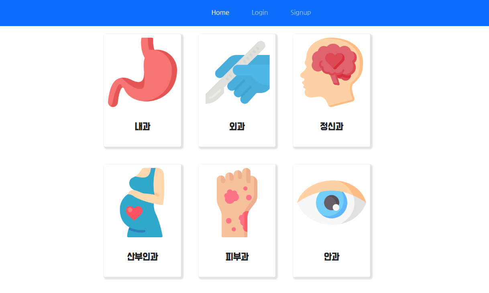
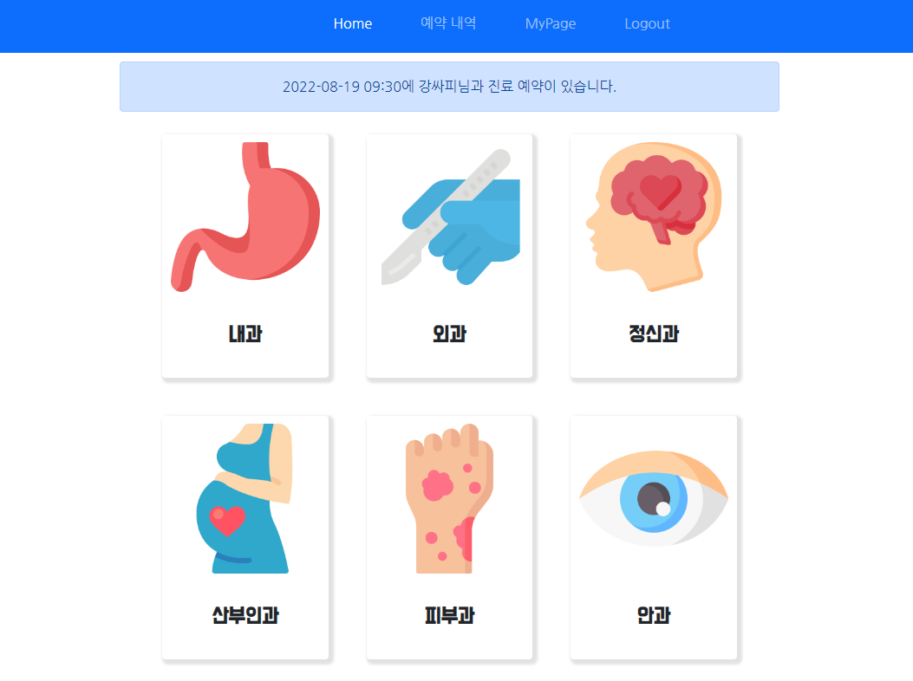
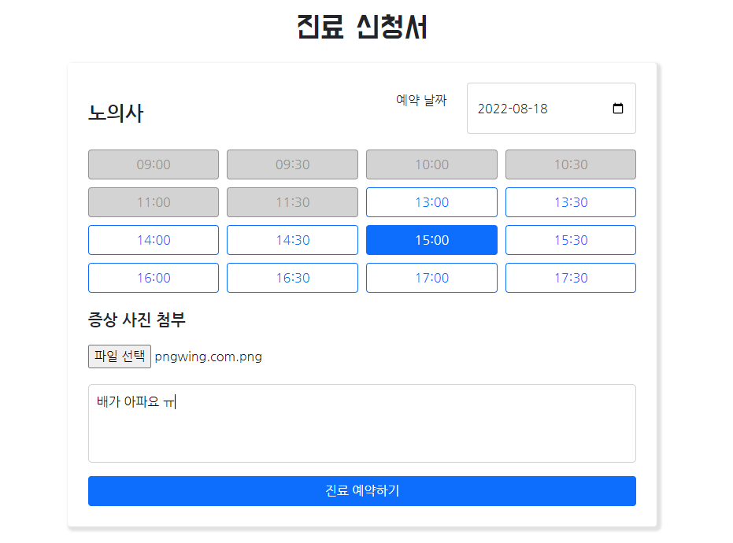
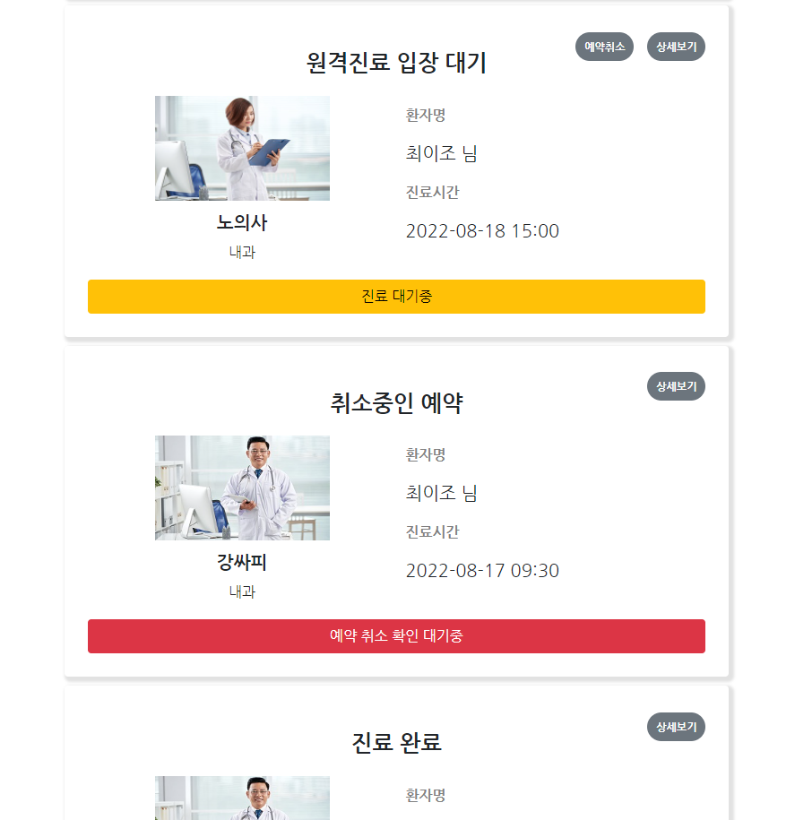
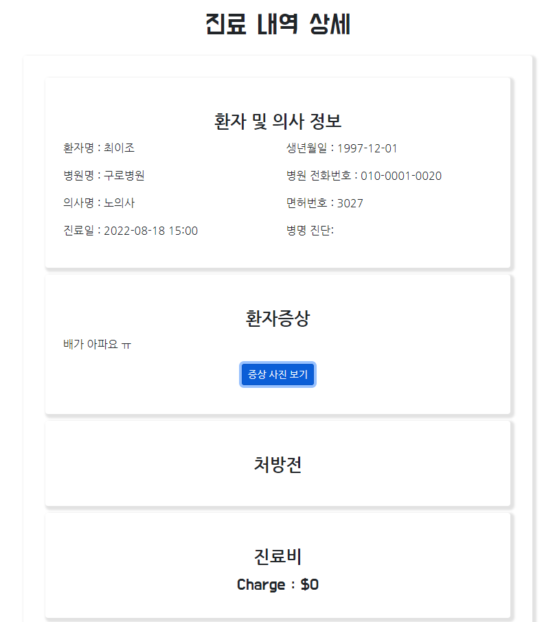
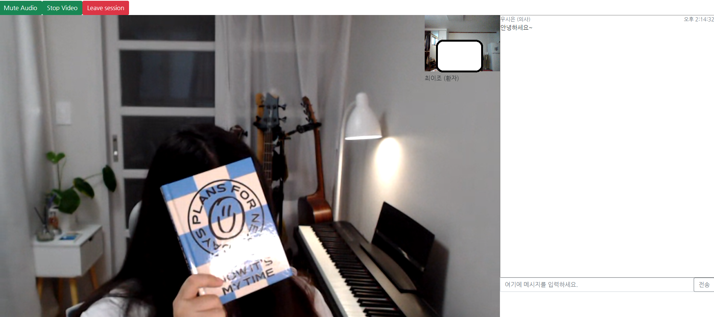
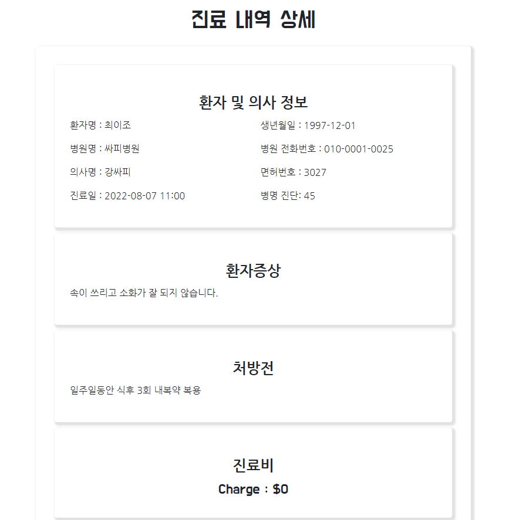

# 시연 시나리오

1. **로그인**
    
    : 로그인 하면 유저 타입에 따라서 헤더 화면이 바뀝니다. 의사로 로그인 하면 진료과는 보이지 않고 진료 내역이 보이게 됩니다.
    
    
    
    - 유저로 로그인 → ID: meetdocPatient, PW: mdpw1234!
2. **진료과 선택 (메인화면)**
    
    : 환자 유저는 메인 화면에 진료과가 보이고 선택해서 예약을 진행할 수 있습니다. 메인 화면에서 열린 진료가 있으면 바로 들어갈 수 있고 그게 아니라면 가장 가까운 예약의 정보를 띄워줍니다.
    
    
    
    - 예약할 의사가 있는 진료과로 선택 → 더미데이터에 작성
3. **의사 선택**
    
    : 병원이나 의사의 이름을 확인하고 예약하고 싶은 의사를 선택할 수 있습니다. 
    
    
    
    - 미리 준비한 의사 선택 (내과 강의사)
4. **예약 - 예약 상태를 보여주는 용도**
    
    : 예약하고 싶은 날짜와 시간을 선택하고 증상 사진과 증상 내용을 입력해서 예약을 할 수 있습니다. 이미 예약이 되어있는 시간은 비활성화 되어있습니다. 그리고 의사가 설정한 영업시간에 따라 30분 단위로 시간이 보이게 됩니다. 예약을 진행하면 예약이 확정되고 의사쪽이나 환자쪽에서 일정 시간 전까지 취소가 가능합니다.
    
    
    
    - 날짜, 시간 선택 (22일 선택)
    - 사진 첨부 - 사진 준비 필요
    - 증상 입력
5. **예약 리스트 확인**
    
    :  예약했던 진료들을 확인할 수 있습니다. 처음 예약하면 대기 상태이고 진료 시간 5분 전에 입장 가능 상태로 바뀌게 됩니다. 상세 정보를 통해서 예약한 정보들을 볼 수 있고 완료된 진료에서는 처방된 내용도 볼 수 있습니다.
    
    
    
    
    
    - 예약 상태 별로 보여주기
        - 미리 DB에 준비해놓기 (상태별로 5개?)
        - 시연 중에 상태에 따라 설명 필요 (간단하게)
    - 방금 예약한 진료를 상세 보기로 처방 작성 안된 화면 보여주기
6. **준비된 예약으로 회의실 들어가기**
    
    : 입장 가능한 예약에서 버튼을 통해 화상회의에 들어갈 수 있습니다. 마이크와 화면을 on/off 할 수 있으며 채팅이 가능합니다. 의사는 화상회의 중에 처방전을 입력하고 임시 저장해서 나중에 내용을 추가하거나 처방전을 완전히 입력할 수 있습니다. 처방전은 한 번만 입력 가능합니다.
    
    
    
    - 의사로 한 명이 미리 들어가 있기
    - 웹엑스 마이크와 비디오를 끄고 화상회의 걸로 켜야함
    - 기능 보여주기 (마이크, 화면, 채팅 등)
    - 처방전 작성
        - 발표 화면 공유를 의사를 맡은 사람으로 바꾸기
    - 회의 종료
7. **회의 종료 후 예약 상세 정보 보여주기**
    
    : 회의 세션에서 나와도 다시 입장이 가능합니다. 진료 상태는 시작 후 30분이 지나면 상태가 바뀌게 됩니다. 처방전이 입력되지 않은 상태라면 처방 입력 대기, 입력한 상태라면 진료 완료가 됩니다.
    
    
    
    - 상태 관련 이슈
        - 일정 시간이 되면 종료된다고 따로 설명
    - 작성된 처방 보여주기
    

## 준비사항
- 사용할 환자와 의사 계정
- 상태별로 예약했던 진료 내역
- 예약 후에 입장 가능한 진료
- **~~의사 사진 넣기~~**
- **~~상세 정보에서 증상 사진 보여주기~~**
## 안보여준 기능
- 회원 가입
- 의사 등록
- 예약 취소
- 예약 취소 확인
- 마이페이지
- 회원 정보 수정
- 의사 정보 수정
- 메인에서 가까운 예약 보여주고 들어가기